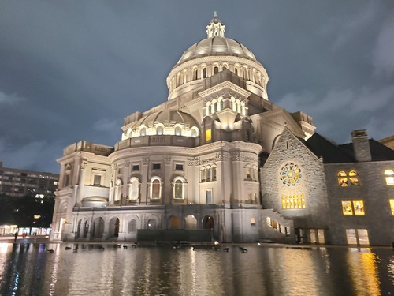

# GRIME: Graphical Image Manipulation and Enhancement

## Requirements

* You must use Java Swing to build your graphical user interface. Besides the code examples from lecture, the provided code example illustrates some other features of Swing that you may find useful.
* The GUI should show the image that is currently being worked on. The image may be bigger than the area allocated to it in your graphical user interface. In this case, the user should be able to scroll the image. Any changes to the current image as a result of the image operations should be visible in the GUI.
* The histogram of the visible image should be visible as a line chart on the screen at all times. If the image is manipulated, the histogram should automatically refresh. The histogram should show the red, green, blue components.
* The user interface must expose the features described in the next section.
* When saving an image as a PNG/PPM/JPG, it should save what the user is currently seeing.
* The user should be able to specify suitably the image to be loaded and saved that the user is going to process. That is, the program cannot assume a hardcoded file or folder to load and save.
* Any error conditions should be suitably displayed to the user, through pop-up messages or clearly visible text as appropriate.
* The layout of the UI should be reasonable. Things should be in proper proportion, and laid out in a reasonable manner. Buttons/text fields/labels that are oversized, or haphazardly arranged, even if functional, will result in a point deduction.
* Each user interaction or user input must be reasonably user-friendly (e.g. making the user type something when a less error-prone method is possible is not good UI design). We do not expect snazzy, sophisticated user-friendly programs. Our standard is: can a user unfamiliar with your code and technical documentation operate the program correctly without reading your code and technical documentation?

## Features exposed through the UI

* The user is expected to work on one image at a time, the image that is visible in the UI.
* Load an image in PPM/JPG/PNG formats. If the currently shown image is not saved, the program should prompt the user accordingly.
* Save the currently visible image in PPM/JPG/PNG formats.
* Visualize the red/green/blue components of an image (the shown image should change accordingly).
* Flip the image vertically or horizontally.
* Blurring the image.
* Sharpening the image.
* Converting the image to greyscale using luma.
* Converting the image to sepia.
* Viewing the image with compression artifacts. The user should be able enter the compression factor in some way. It is reasonable to expect the user to enter only integral percentages, although this restriction is not required.
* Viewing the color-corrected version of this image.
* Adjust levels of this image. The user should be able to enter the black, white and mid-values in some reasonable way. You are not required to support the traditional "drag-a-point" interface that was illustrated in Gimp.
* Be able to toggle between showing a split view and the entire image, with a way to enter the split percentage in a reasonable way. Changing the split percentage should show the modified result quickly, as this is the point of viewing an operation in split view. This should only affect certain operations as before.

## Design for GRIME


## Screenshot of the program when an image is loaded


## Changes to Existing Design

We consider our design close to perfect, as the changes were minimal, with seamless integration of new features in isolation.

### 1. Type Checking Fix in Commands
Replaced checks for the concrete type (`MIMEFacadeImpl`) with checks for the interface type (`MIMEFacade`) in the `instanceof` statements within the `run` methods of the `Histogram` and `ColorCorrect` commands. This aligns with the expected approach.

### 2. Validation for Invalid Split Percentages
Implemented validation for invalid split percentages in the `colorCorrect`, `sepia`, `luma`, `blur`, `sharpen`, and `adjustLevels` methods of `MIMEFacadeImpl`. This enhancement addresses a condition we overlooked in the previous assignment.

### 3. Main Function Modification for New Requirements
Modified the `main` function to accommodate new requirements, enabling GUI execution and supporting the `-text` parameter.

### 4. Prevention of External Access in Model
Introduced a new method (`getRawImageData`) in the model (`IMEFacade` and `IMEFacadeImpl`) to obtain raw image data as a three-dimensional array. This addition serves as a preventive measure, restricting external access to model reference objects to prevent misuse.

### 5. Histogram Refinements
Made the width and height of the histogram configurable by introducing a constructor in `PlotHistogramImpl` and setting them as attributes. Additionally, adjusted the vertical scaling factor for histogram curves by using the maximum peak value among all three channels, introducing an attribute named `maxFrequency`. These enhancements are aimed at providing a better view in the user interface.

## New Features

### Introduction of View 

The MVC architecture is now complete with the introduction of the View. Our view extends the JFrame class, initializes a 
window, and incorporates menu options for image load/save. It displays the current image in the top left corner and its 
histogram on the right. The View supports simple effects like horizontal flip, vertical flip, and extracting the red, blue, 
and green components of the image. Additionally, it facilitates advanced operations such as compression, level adjustment, 
sepia, luma, color correction, and sharpening. The View includes a preview of a split view for advanced operations, 
allowing users to set the percentage and toggle back to the original image before applying the operation. Error messages 
are displayed for unexpected events, such as invalid user inputs. Various Java Swing components, such as `JComboBox`, 
`JButton`, `JLabel`, `JCheckbox`, `JTextField`, `JMenu`, `JMenuItem`, `JPanel`, `JScrollPane`, `GridLayout`, `BoxLayout`, `FlowLayout`, and 
`JFileChooser`, are utilized. User actions trigger callbacks to controller methods, directing the model/view to perform the 
required operations, achieving true MVC.

### Introduction of Adapter Design Pattern
To prevent direct access to the model reference by the view/controller, an adapter was introduced. 
This adapter, using composition, encapsulates the model and provides image data to the 
view as an integer array. This design choice aligns with the **Model-View-ViewModel (MVVM)** 
paradigm.

### Package `view`
Added a new interface for the view called `IView`, along with a concrete implementation named `View`.

### Package `model`
Introduced a new interface, `IViewModel`, with a concrete implementation call `ViewModel` acting as an adapter for the model/image data.

### Package `controller`
Added a new interface called `Features`, representing callbacks for view actions, with a concrete implementation named `GUIController`.

Our code continues to adhere to solid principles. **A big shout-out to MVC, MVVM, Command Design, Facade, and Adapter design patterns!**

# MIME: More Image Manipulation and Enhancement

## Requirements

* Support the ability to create a compression version of an image. This must be supported by the script command "compress percentage image-name dest-image-name". Percentages between 0 and 100 are considered valid.
* Support the ability to produce an image that represents the histogram of a given image. The size of this image should be 256x256. It should contain the histograms for the red, green and blue channels as line graphs. The grid pattern shown in the examples is optional, but helpful ( Hint : the BufferedImage class may be helpful, specifically because it provides an ability to draw on it). This should be supported by the script command "histogram image-name dest-image-name".
* Support the ability to color-correct an image by aligning the meaningful peaks of its histogram. This must be supported by the script command "color-correct image-name dest-image-name".
* Support the ability to adjust levels of an image. This must be supported by the script command "levels-adjust b m w image-name dest-image-name" where b, m and w are the three relevant black, mid and white values respectively. These values should be ascending in that order, and should be within 0 and 255 for this command to work correctly.
* Support the ability to specify a vertical line to generate a split view of operations. The operations that must support this are blur, sharpen, sepia, greyscale, color correction and levels adjustment. The script commands for these operations must accommodate an optional parameter for the placement of the splitting line. For example, blur can be done by "blur image-name dest-image-name" or "blur image-name dest-image split p" in that order where 'p' is a percentage of the width (e.g. 50 means place the line halfway through the width of the image). The output image should show only the relevant part suitably transformed, with the original image in the remaining part.
* Support the ability to accept a script file as a command-line option. For example "-file name-of-script.txt". If a valid file is provided, the program should run the script and exit. If the program is run without any command line options, then it should allow interactive entry of script commands as before.

## Changes to Existing Design

### 1. Access Scope Changes

Changed the access scope of few variables from private to protected to support inheritance (`imageRepository` in `IMEFacade`, specifications of `IMECommand` such as `Blur`, `Sepia`, `Sharpen`, and `Luma`). The justification is that it is recommended to have the most constrained scope when in doubt. Hence, they were made private initially. But now, since they need to be extended to accommodate new features, the variables had to be inherited by the child class. Hence, made them protected.

### 2. CommandRepositoryImpl Renamed

Renamed `CommandRepositoryImpl` to `IMECommandRepository` as it made more sense.

### 3. Image Interface Changes

Added new methods to the `Image` interface (`getPortion`, `replacePortion`). Although technically considered a code change, we did not change any of the existing code. Just added new methods to support new operations.

### 4. Instance Type Change

Changed the instance type from `RGBPixel` to `Pixel` to use the interface type. This was a feedback given in the manual review of the previous assignment.

### 5. RunScript Command Change

In the `RunScript` command, changed the `CommandRepository` type to point to the new version with the ability to support the new commands in the script file.

### 6. Main Function Modification

In the `Main` function, made necessary changes to accept the script file as a command line argument and used the new implementation of the `IMEFacade` interface.

## Assumption

We are making the assumption that commands always come in one line from the user / in the script file.

## Design for MIME

Still adhering to the OOP principles and MVC Design pattern, and Controller is still implementing the Command Design Pattern.

### Package `model`
* Created a new interface (`MIMEFacade`) to support new operations. Used method overloading to support additional parameters for existing commands (split for luma, blur, sepia, and sharpen).
* Created the implementation `MIMEFacadeImpl` that inherits the previously supported operations from `IMEFacadeImpl` and implements the new operations using the `MIMEFacade` interface.
* Created a general-purpose `ImageCompressor` with to compress an input image given the percentage and created a specification called `HaarWaveletImageCompressor` to compress the image using the concept of Haar Wavelet Transformation and Inversion.
* Created a utility class called `HaarWaveletUtil` with support to obtain Haar transformation and inversion for 2D matrices.
* Created a utility class called `MathUtil` with support to find the nearest power of 2 to a number.
* Added new methods to `Image` interface to support getting and replacing a portion in an image and implemented them in `RGBPixel`.
* In the `RGBImage`, completed the implementation for the clone method to create an exact copy of the image object.
* Created a helper interface called `LevelAdjustCurve` and a specification called `LevelAdjustCurveImpl` to support fitting a quadratic equation given black, mid, and white values.
* Created an interface called `PlotHistogram` and a specification called `PlotHistogramImpl` to create the histogram image with the frequency data. We believed this logic should reside in the model as it is dealing with processing of histogram data calculating differences to draw the histogram.
* Created an interface called `HistogramGenerator` and a specification called `HistogramGeneratorImpl` to generate the histogram data for an `Image`.
* Created a helper interface called `FrequencyCounter` and a specification called `FrequencyCounterImpl` to obtain the frequency counts for an array of values.

### Package `commands`

* In the controller, added new classes that code to `IMECommand` interface that extends the functionality of existing commands to support optional parameters (`SepiaWithParams`, `LumaWithParams`, `SharpenWithParams` and `BlurWithParams`). Also created command classes to support new operations (`LevelAdjustWithParams` and `ColorCorrectWithParams`).

### Package `controller`

* Created a new specification for `CommandRepository` called `MIMECommandRepository` to support new commands and enhanced versions of existing commands.

##### Note: The images intended for testing have been removed to address the file count limit issue on the server.

# IME: Image Manipulation and Enhancement

## Requirements

Program should support loading, manipulating and saving images using simple text-based
commands.

* Load an image from an ASCII PPM, JPG or PNG file.
* Create images that visualize individual R,G,B components of an image.
* Create images that visualize the value, intensity or luma of an image.
* Flip an image horizontally or vertically.
* Brighten or darken an image.
* Split a single image into 3 images representing each of the three channels.
* Combine three greyscale image into a single color image whose R,G,B values come from the three
  images.
* Blur or sharpen an image.
* Convert an image into sepia.
* Save an image to an ASCII PPM, JPG or PNG file.
* Allow a user to interact with your program to use these operations, using text-based scripting.

## Design

Our design follows MVC Pattern.

1. The model represents data and its operations.
2. The Controller interacts with both the user and the model.
3. Currently, there isn't a specific view, as the user interacts with commands, a need fulfilled by the Controller using the Command Design Pattern.

## Package `ime`

This is our main package that incorporates the MVC design pattern for the given problem statement.

**Package `model`:** Defines our model, which, in this case, is an image processor acting as a facade. It can store the resulting images of various operations in a given session.

**Package `controller`:** Defines our controller that uses the model object to perform user-requested operations via commands.

As of now, there is no specific view implemented. User input comes in the form of text-based commands handled by the controller, implementing the Command design pattern. As the application grows and new requirements emerge, a dedicated view with its own package will be incorporated.

### Model

Our main model is an image manipulator and enhancer, acting as the front face for the controller to execute user-requested operations. It serves as a facade, utilizing different other package-private models to execute the required operations.

- **Class `IMEFacadeImpl`:** Represents our facade model, implementing the `IMEFacade` interface. It performs various image processing/enhancement operations and stores the results in an in-memory repository. This is the only model visible to the controller.

- **Interface `Image`:** A generic interface representing any image composed of pixels.

- **Class `RGBImage`:** Represents a color image with red, green, and blue channels of a given height and width, along with a max value for the pixel. It implements the `Image` interface and can be extended in the future to add more components such as transparency.

- **Interface `Pixel`:** Represents a generic pixel with various operations like luma, value, and intensity. It also offers a method to return a brighter version of itself given an increment.

- **Class `RGGBPixel`:** Represents a pixel in a color image with red, green, and blue components, along with properties like luma, value, and intensity.

- **Class `PixelTransformer`:** Represents an image processor implementing the `ImageProcessor` interface, transforming every pixel in the input image using a lambda function to produce the output image.

- **Class `Filter`:** Represents an image processor implementing the `ImageProcessor` interface to perform filtering operations using a kernel of a given size. Supported filtering operations include Blur and Sharpen.

- **Class `LinearTransformer`:** Represents an image processor performing a linear transformation operation using an input matrix, implementing the `ImageProcessor` interface. Sepia is an implemented linear color transformation operation. All image processors (Filter, PixelTransformer, and LinearTransformer) are generic, enabling different operations on an input image to produce an output image.

- **Interface `ImageRepository`:** A generic repository representing data storage for images. It can be further implemented as a database repository to store images in a database.

- **Class `InMemoryRepository`:** Represents a repository of enhanced images within a session, implementing the `ImageRepository` interface.

### Controller

**Interface `Controller`:** Defines our controller, which takes a model object and follows the command design pattern.

- **Class `CommandController`:** A specification that accepts text commands as input from the user.

- **Helper Classes:** There are helper classes to load and save images of different types (PPM, JPG, BMP, PNG).

  - **Interface `ImageReader`:** A generic interface to read any image from the disk.

  - **Class `PPMImageReader`:** Implements the `ImageReader` interface to support reading a PPM image.

  - **Class `ImageIOReader`:** Implements the `ImageReader` interface to support other file formats such as JPG, BMP, PNG.

  - **Interface `ImageWriter`:** A generic interface to write an image to the disk.

  - **Class `PPMImageWriter`:** Implements the `ImageWriter` interface to support writing a PPM image.

  - **Class `ImageIOWriter`:** Implements the `ImageWriter` interface to support other file formats such as JPG, BMP, PNG.

  - **Interface `ImageReaderFactory`:** A generic interface containing a factory method to obtain the appropriate `ImageReader` based on the file extension.

  - **Interface `ImageWriterFactory`:** A generic interface containing a factory method to obtain the appropriate `ImageWriter` based on the file extension.

  - **Class `ImageReaderFactoryImpl`:** Specification of `ImageReaderFactory`.

  - **Class `ImageWriterFactoryImpl`:** Specification of `ImageWriterFactory`.

  - **Class `FileUtil`:** A file utility class containing methods to read a file cleanly (removing empty lines and commands) and obtain its extension.

  - **Interface `CommandRepository`:** Represents a repository of commands used to perform image manipulation and enhancement.

  - **Class `CommandRepositoryImpl`:** Specification of `CommandRepository`.


### Package `commands`

All commands for the controller, implemented using the command design pattern, are listed below:

**Interface `IMECommand`:** Defines the type of command, having only one method, `run`, which runs the respective command.

- **Classes acting as commands:**
  1. `BlueComponent`: Create an image with the blue component of the given image's name.
  2. `Blur`: Blur the given image.
  3. `GreenComponent`: Create an image with the green component of the given image's name.
  4. `HorizontalFlip`: Flip an image horizontally to create a new image.
  5. `VerticalFlip`: Flip an image vertically to create a new image.
  6. `Intensity`: Create an image with the intensity of the given image's name.
  7. `Load`: Load an image from the specified path.
  8. `Save`: Save the image with the given name to the specified path.
  9. `Luma`: Create an image with the luma component of the image.
  10. `Value`: Create an image with the value of the image.
  11. `RGBCombine`: Combine the three images individually (red, green, and blue) into a single image.
  12. `RGBSplit`: Split the given image into three images containing its red, green, and blue components respectively.
  13. `Sepia`: Produce a sepia-toned version of the given image.
  14. `Sharpen`: Sharpen the given image.
  15. `RunScript`: Load and run the script commands from the specified file.
  16. `RedComponent`: Create an image with the red component of the image.
  17. `Brighten`: Brighten the image by the given increment.

### Running the Program

Navigate to `src` -> `ime.Main` -> Run this file in the IDE. It creates a controller object and calls the `goAhead` method of the controller, initiating the program.

Please refer to the USEME.md file, which contains more details about all the commands.

### Commands that the program accepts

###### Loads a new image with the given name.

```
load res/test.jpg test
```

###### Saves the resulting image with the new name provided.

```
save res/test-save.jpg test
```

###### Increases the brightness of test image by a scale of 10 for the loaded image.

```
brighten 10 test test-brighter
```

###### Saves the resulting image with the new name provided.

```
save res/test-brighter-10.jpg test-brighter
```

###### Flips the test image vertically

```
vertical-flip test test-vertical
```

###### Saves the resulting image with the new name provided.

```
save res/test-vertical.jpg test-vertical
```

###### Flips the test image horizontally

```
horizontal-flip test-vertical test-vertical-horizontal
```

###### Saves the resulting image with the new name provided.

```
save res/test-vertical-horizontal.jpg test-vertical-horizontal
```

###### Creates a greyscale image considering the red component

```
red-component test test-greyscale-red
```

###### Saves the resulting image with the new name provided.

```
save res/test-greyscale-red.jpg test-greyscale-red
```
``
###### Creates a greyscale image considering the green component

```
green-component test test-greyscale-green
```

###### Saves the resulting image with the new name provided.

```
save res/test-greyscale-green.jpg test-greyscale-green
```

###### Creates a greyscale image considering the blue component

```
blue-component test test-greyscale-blue
```

###### Saves the resulting image with the new name provided.

```
save res/test-greyscale-blue.jpg test-greyscale-blue
```

###### Creates a greyscale image with value formula.

```
value test test-greyscale-value
```

###### Saves the resulting image with the new name provided.

```
save res/test-greyscale-value.jpg test-greyscale-value
```

###### Creates a greyscale image with luma formula.

```
luma test test-greyscale-luma
```

###### Saves the resulting image with the new name provided.

```
save res/test-greyscale-luma.jpg test-greyscale-luma
```

###### Creates a greyscale image with intensity formula.

```
intensity test test-greyscale-intensity
```

###### Saves the resulting image with the new name provided.

```
save res/test-greyscale-intensity.jpg test-greyscale-intensity
```

###### Produce a sepia-toned version of the given image and store the result in another image with the given name.

```
sepia test test-sepia
```

###### Saves the resulting image with the new name provided.

```
save res/test-sepia.jpg test-sepia
```

###### Blur the given image and store the result in another image with the given name.

```
blur test test-blur
```

###### Saves the resulting image with the new name provided.

```
save res/test-blur.jpg test-blur
```

###### Sharpen the given image and store the result in another image with the given name.

```
sharpen test test-sharpen
```

###### Saves the resulting image with the new name provided.

```
save res/test-sharpen.jpg test-sharpen
```

###### Splits an image into its red, green and blue greyscale images respectively.

```
rgb-split test test-red test-green test-blue
```

###### Saves the resulting images with the new names provided.

```
save res/test-split-red.jpg test-red
save res/test-split-green.jpg test-green
save res/test-split-blue.jpg test-blue
```

###### Combines 3 different greyscale images taking each one's red, green and blue components.

```
rgb-combine test-combined test-red test-green test-blue
```

###### Saves the resulting image with the new name provided.

```
save res/test-combined.jpg test-combined
```

###### Plot the histogram for the test image.

```
histogram test test-histogram
```

###### Save the histogram for the test image.

```
save res/test-histogram.jpg test-histogram
```

###### Compress the image by 50 percent.

```
compress 50 test test-compress-50
```

###### Saves the resulting image with the new name provided.

```
save res/test-compress-50.jpg test-compress-50
```

###### Plot the histogram for the resultant image.

```
histogram test-compress-50 test-compress-50-histogram
```

###### Save the histogram for the resultant image.

```
save res/test-compress-50-histogram.jpg test-compress-50-histogram
```

###### Compress the image by 90 percent.

```
compress 90 test test-compress-90
```

###### Saves the resulting image with the new name provided.

```
save res/test-compress-90.jpg test-compress-90
```

###### Plot the histogram for the resultant image.

```
histogram test-compress-90 test-compress-90-histogram
```

###### Save the histogram for the resultant image.

```
save res/test-compress-90-histogram.jpg test-compress-90-histogram
```

###### Adjust levels for the given image.

```
levels-adjust 20 100 255 test test-levels-adjust-20-100-255
```

###### Saves the resulting image with the new name provided.

```
save res/test-levels-adjust-20-100-255.jpg test-levels-adjust-20-100-255
```

###### Plot the histogram for the resultant image.

```
histogram test-levels-adjust-20-100-255 test-levels-adjust-20-100-255-histogram
```

###### Save the histogram for the resultant image.

```
save res/test-levels-adjust-20-100-255-histogram.jpg test-levels-adjust-20-100-255-histogram
```

###### Adjust levels for the given portion of the image.

```
levels-adjust 20 100 255 test test-levels-adjust-20-100-255-split-50 split 50
```

###### Saves the resulting image with the new name provided.

```
save res/test-levels-adjust-20-100-255-split-50.jpg test-levels-adjust-20-100-255-split-50
```

###### Plot the histogram for the resultant image.

```
histogram test-levels-adjust-20-100-255-split-50 test-levels-adjust-20-100-255-split-50-histogram
```

###### Save the histogram for the resultant image.

```
save res/test-levels-adjust-20-100-255-split-50-histogram.jpg test-levels-adjust-20-100-255-split-50-histogram
```

###### Perform color correction for the given the image.

```
color-correct test test-color-correct
```

###### Saves the resulting image with the new name provided.

```
save res/test-color-correct.jpg test-color-correct
```

###### Plot the histogram for the resultant image.

```
histogram test-color-correct test-color-correct-histogram
```

###### Save the histogram for the resultant image.

```
save test-color-correct-histogram.jpg test-color-correct-histogram
```

###### Perform color correction for the given portion of the image.

```
color-correct test test-color-correct-split-50 split 50
```

###### Saves the resulting image with the new name provided.

```
save res/test-color-correct-split-50.jpg test-color-correct-split-50
```

###### Plot the histogram for the resultant image.

```
histogram test-color-correct-split-50 test-color-correct-split-50-histogram
```

###### Save the histogram for the resultant image.

```
save res/test-color-correct-split-50-histogram.jpg test-color-correct-split-50-histogram
```

###### Generate sepia for the given portion of the image.

```
sepia test test-sepia-split-50 split 50
```

###### Saves the resulting image with the new name provided.

```
save res/test-sepia-split-50.jpg test-sepia-split-50
```

###### Generate luma for the given portion of the image.

```
luma test test-luma-split-50 split 50
```

###### Saves the resulting image with the new name provided.

```
save res/test-luma-split-50.jpg test-luma-split-50
```

###### Blur the given portion of the image.

```
blur test test-blur-split-50 split 50
```

###### Saves the resulting image with the new name provided.

```
save res/test-blur-split-50.jpg test-blur-split-50
```

###### Sharpen the given portion of the image.

```
sharpen test test-sharpen-split-50 split 50
```

###### Saves the resulting image with the new name provided.

```
save res/test-sharpen-split-50.jpg test-sharpen-split-50
```

###### Runs the commands present in a script file given the path to the file.

```
run res/script.txt
```

### Exception Handling

We handle exceptions by displaying meaningful messages to the user in different 
error scenarios, such as when the input file is invalid, the operation is not supported or 
the passed arguments are invalid.

### Image Citation:

> The First Church of Christ, Scientist, Boston
> 

Author: Pruthvi Prakash Navada

Date: August 10, 2023.

Source: Captured the First Church of Christ, Scientist, illuminated under the enchanting night sky in Boston.

Usage Terms: This image is my original work, and I authorize its use in this project.
