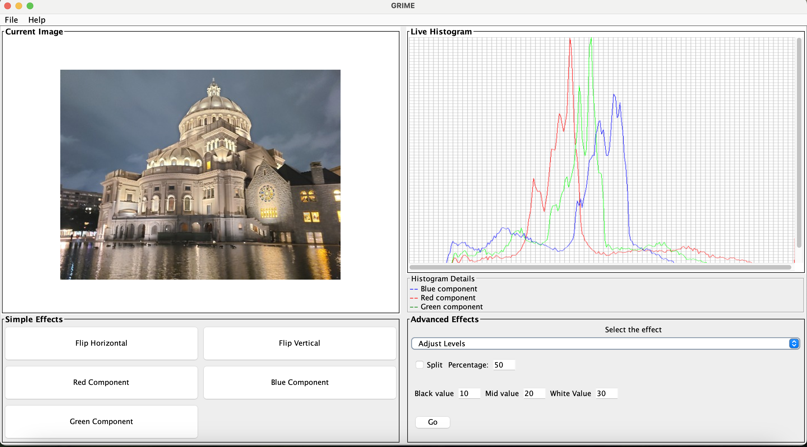

# User Interface and Features

## Features
* Load/Save images in PPM, PNG, JPEG/JPG formats. 
* Apply simple effects such as flipping the image horizontally/vertically or obtaining the red, blue, or green components of the image.
* Apply advanced effects like blur, sharpen, sepia, compress, luma, color correct, and levels adjustment. 
* Preview the operation result in a split view before transforming the image. 
* Provide instructions for new users on how to use the application. 
* Notify users when attempting to load a new image without saving the currently transformed image. 
* Display appropriate error messages in different scenarios.

## Screenshot of the application


## Usage
* Navigate to `res -> GRIME.jar`. Run the application by double-clicking on the jar. 
* Load an image in the desired format by navigating to `File -> Load`. 
* The live histogram of the currently loaded image is displayed on the right side. 
* Perform simple effects by clicking on buttons in the bottom-left panel. 
* Execute advanced effects by selecting the operation from the combo box in the bottom-right panel, providing necessary inputs, and clicking the `Go` button. 
* Preview advanced effects by checking the `Split` checkbox, specifying the split percentage, and clicking `Go`. To exit from the preview, uncheck the `Split` checkbox. 
* Save the transformed image by clicking on `File -> Save as`. Choose the path, provide the image name, and click `Save`. 
* Access instructions by clicking on `Help -> How to use`. Close the application by clicking the close button at the top left/right.

### Image View
The current image is displayed in the top-left panel. Scroll bars are enabled to maintain the image's size and view in full.

### Live Histogram
Displayed in the top-right panel, it shows the live histogram of the currently loaded image with three curves representing the red, green, and blue channels.

### Basic Operations
After loading the image, perform basic operations by clicking the respective buttons in the Simple Effects panel (`Flip Horizontal`, `Flip Vertical`, `Red Component`, `Green Component`, and `Blue Component`) at the bottom-left of the UI.

### Advanced Operations
* The bottom-right panel includes a combo box for advanced operations like `Adjust Levels`, `Blur`, `Color Correct`, `Compress`, `Sepia`, `Luma`, and `Sharpen`. Select the desired operation, provide inputs, and click `Go` to see the transformed image. Preview by checking the `Split` checkbox and specifying the percentage. To return to the original image, uncheck the `Split` checkbox.
* Split percentage should be a number between 0 and 100 (inclusive).
* Compression factor should be a number between 0 and 100 (inclusive).
* Black, mid, and white values for levels adjustment should be integers in the range 0 to 255 (inclusive), in ascending order.

# Commands that are supported by the application and its usage.

### To run the script file in command-line

* Open terminal/cmd at the location of jar file : `res` ->
  `GRIME.jar`<br>
* Run `java -jar GRIME.jar -file script.txt`

The above step runs all the commands that are supported by the applications and operates
on the test image and saves all the resulting images in the res folder.

### Running the project interactively.

#### Method 1. To run the project from jar file.

* open terminal/cmd at location where the jar file is present : `res` ->
  `GRIME.jar`<br>
* Run `java -jar GRIME.jar -text`

#### Method 2. To run the project in IDE.

* In `src`
* Open file `Main.java`
* Run the `main` method.

##### Command to run a set of commands in a file.

```
run script.txt
```

Running the above script also runs all the commands, similar to what we saw above, but here it is running inside the program interactively.

###### Loads a new image with the given name.

```
load test.jpg test
```

###### Saves the resulting image in the given format with the new name provided.

```
save test-save.jpg test
```

###### Increases the brightness of test image by a scale of 10 for the loaded image.

```
brighten 10 test test-brighter
```

###### Saves the resulting image with the new name provided.

```
save test-brighter-10.jpg test-brighter
```

###### Flips the test image vertically

```
vertical-flip test test-vertical
```

###### Saves the resulting image with the new name provided.

```
save test-vertical.jpg test-vertical
```

###### Flips the test image horizontally

```
horizontal-flip test-vertical test-vertical-horizontal
```

###### Saves the resulting image with the new name provided.

```
save test-vertical-horizontal.jpg test-vertical-horizontal
```

###### Creates a greyscale image considering the red component

```
red-component test test-greyscale-red
```

###### Saves the resulting image with the new name provided.

```
save test-greyscale-red.jpg test-greyscale-red
```

###### Creates a greyscale image considering the green component

```
green-component test test-greyscale-green
```

###### Saves the resulting image with the new name provided.

```
save test-greyscale-green.jpg test-greyscale-green
```

###### Creates a greyscale image considering the blue component

```
blue-component test test-greyscale-blue
```

###### Saves the resulting image with the new name provided.

```
save test-greyscale-blue.jpg test-greyscale-blue
```

###### Creates a greyscale image with value formula.

```
value test test-greyscale-value
```

###### Saves the resulting image with the new name provided.

```
save test-greyscale-value.jpg test-greyscale-value
```

###### Creates a greyscale image with luma formula.

```
luma test test-greyscale-luma
```

###### Saves the resulting image with the new name provided.

```
save test-greyscale-luma.jpg test-greyscale-luma
```

###### Creates a greyscale image with intensity formula.

```
intensity test test-greyscale-intensity
```

###### Saves the resulting image with the new name provided.

```
save test-greyscale-intensity.jpg test-greyscale-intensity
```

###### Produce a sepia-toned version of the given image and store the result in another image with the given name.

```
sepia test test-sepia
```

###### Saves the resulting image with the new name provided.

```
save test-sepia.jpg test-sepia
```

###### Blur the given image and store the result in another image with the given name.

```
blur test test-blur
```

###### Saves the resulting image with the new name provided.

```
save test-blur.jpg test-blur
```

###### Sharpen the given image and store the result in another image with the given name.

```
sharpen test test-sharpen
```

###### Saves the resulting image with the new name provided.

```
save test-sharpen.jpg test-sharpen
```

###### Splits an image into its red, green and blue greyscale images respectively.

```
rgb-split test test-red test-green test-blue
```

###### Saves the resulting images with the new names provided.

```
save test-split-red.jpg test-red
save test-split-green.jpg test-green
save test-split-blue.jpg test-blue
```

###### Combines 3 different greyscale images taking each one's red, green and blue components.

```
rgb-combine test-combined test-red test-green test-blue
```

###### Saves the resulting image with the new name provided.

```
save test-combined.jpg test-combined
```

###### Plot the histogram for the test image.

```
histogram test test-histogram
```

###### Save the histogram for the test image.

```
save test-histogram.jpg test-histogram
```

###### Compress the image by 50 percent.

```
compress 50 test test-compress-50
```

###### Saves the resulting image with the new name provided.

```
save test-compress-50.jpg test-compress-50
```

###### Plot the histogram for the resultant image.

```
histogram test-compress-50 test-compress-50-histogram
```

###### Save the histogram for the resultant image.

```
save test-compress-50-histogram.jpg test-compress-50-histogram
```

###### Compress the image by 90 percent.

```
compress 90 test test-compress-90
```

###### Saves the resulting image with the new name provided.

```
save test-compress-90.jpg test-compress-90
```

###### Plot the histogram for the resultant image.

```
histogram test-compress-90 test-compress-90-histogram
```

###### Save the histogram for the resultant image.

```
save test-compress-90-histogram.jpg test-compress-90-histogram
```

###### Adjust levels for the given image.

```
levels-adjust 20 100 255 test test-levels-adjust-20-100-255
```

###### Saves the resulting image with the new name provided.

```
save test-levels-adjust-20-100-255.jpg test-levels-adjust-20-100-255
```

###### Plot the histogram for the resultant image.

```
histogram test-levels-adjust-20-100-255 test-levels-adjust-20-100-255-histogram
```

###### Save the histogram for the resultant image.

```
save test-levels-adjust-20-100-255-histogram.jpg test-levels-adjust-20-100-255-histogram
```

###### Adjust levels for the given portion of the image.

```
levels-adjust 20 100 255 test test-levels-adjust-20-100-255-split-50 split 50
```

###### Saves the resulting image with the new name provided.

```
save test-levels-adjust-20-100-255-split-50.jpg test-levels-adjust-20-100-255-split-50
```

###### Plot the histogram for the resultant image.

```
histogram test-levels-adjust-20-100-255-split-50 test-levels-adjust-20-100-255-split-50-histogram
```

###### Save the histogram for the resultant image.

```
save test-levels-adjust-20-100-255-split-50-histogram.jpg test-levels-adjust-20-100-255-split-50-histogram
```

###### Perform color correction for the given the image.

```
color-correct test test-color-correct
```

###### Saves the resulting image with the new name provided.

```
save test-color-correct.jpg test-color-correct
```

###### Plot the histogram for the resultant image.

```
histogram test-color-correct test-color-correct-histogram
```

###### Save the histogram for the resultant image.

```
save test-color-correct-histogram.jpg test-color-correct-histogram
```

###### Perform color correction for the given portion of the image.

```
color-correct test test-color-correct-split-50 split 50
```

###### Saves the resulting image with the new name provided.

```
save test-color-correct-split-50.jpg test-color-correct-split-50
```

###### Plot the histogram for the resultant image.

```
histogram test-color-correct-split-50 test-color-correct-split-50-histogram
```

###### Save the histogram for the resultant image.

```
save test-color-correct-split-50-histogram.jpg test-color-correct-split-50-histogram
```

###### Generate sepia for the given portion of the image.

```
sepia test test-sepia-split-50 split 50
```

###### Saves the resulting image with the new name provided.

```
save test-sepia-split-50.jpg test-sepia-split-50
```

###### Generate luma for the given portion of the image.

```
luma test test-luma-split-50 split 50
```

###### Saves the resulting image with the new name provided.

```
save test-luma-split-50.jpg test-luma-split-50
```

###### Blur the given portion of the image.

```
blur test test-blur-split-50 split 50
```

###### Saves the resulting image with the new name provided.

```
save test-blur-split-50.jpg test-blur-split-50
```

###### Sharpen the given portion of the image.

```
sharpen test test-sharpen-split-50 split 50
```

###### Saves the resulting image with the new name provided.

```
save test-sharpen-split-50.jpg test-sharpen-split-50
```